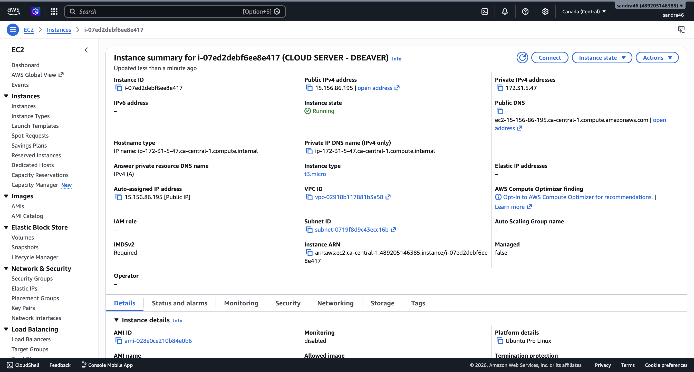
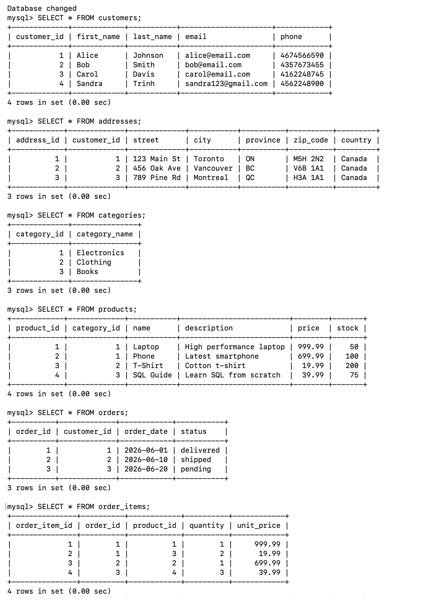
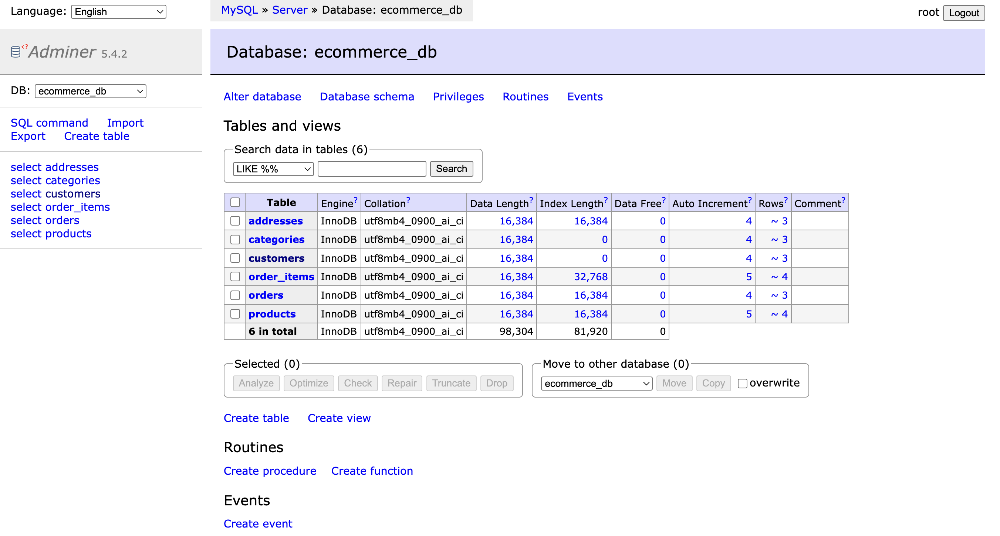
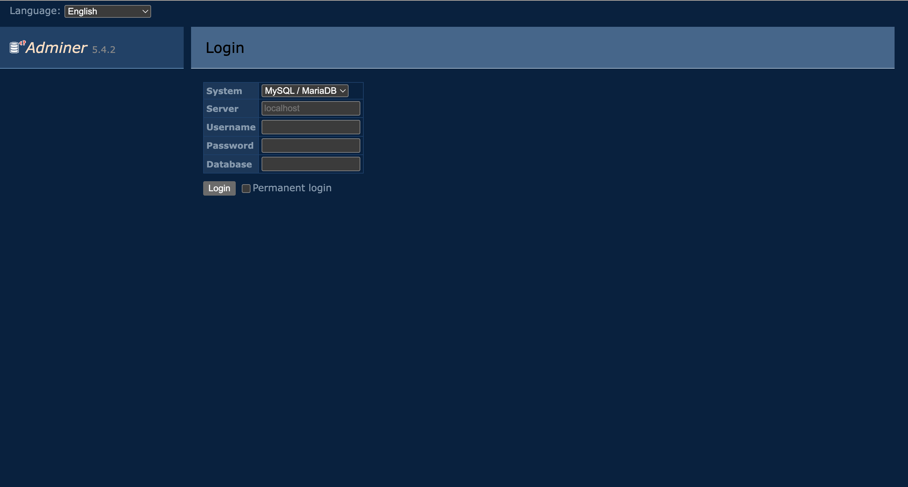
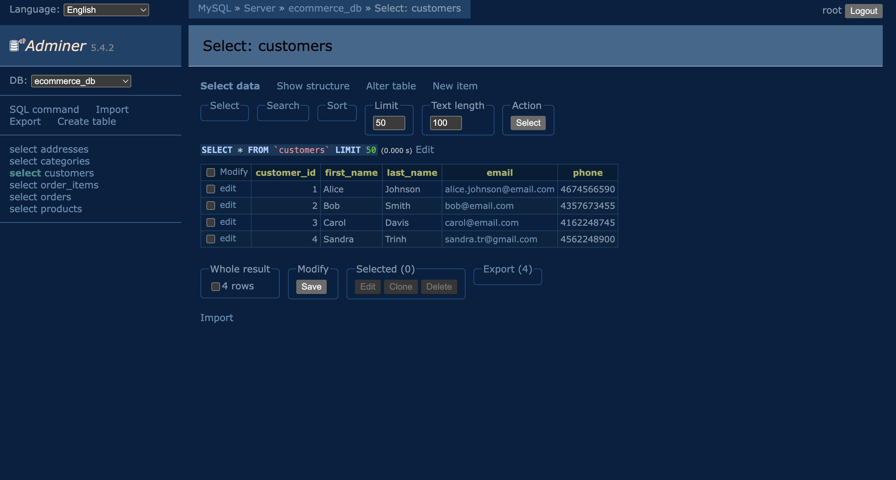
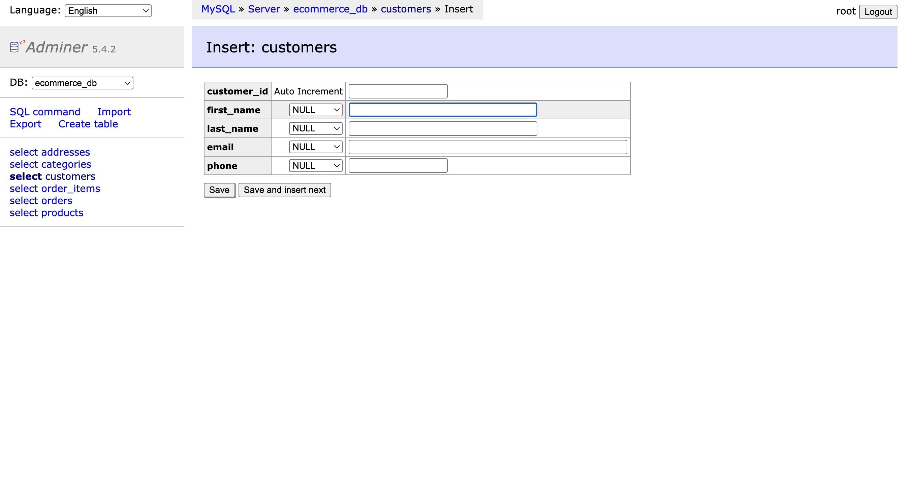
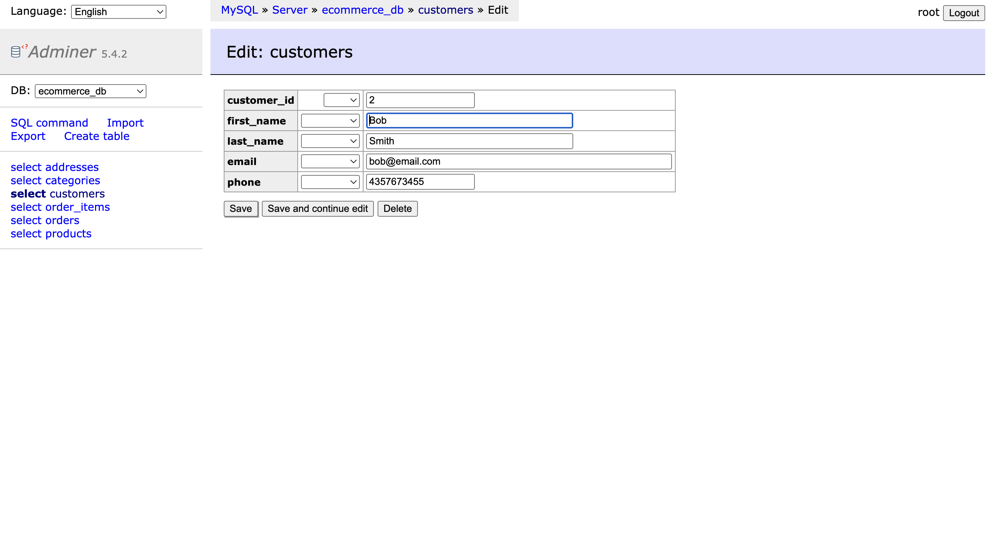
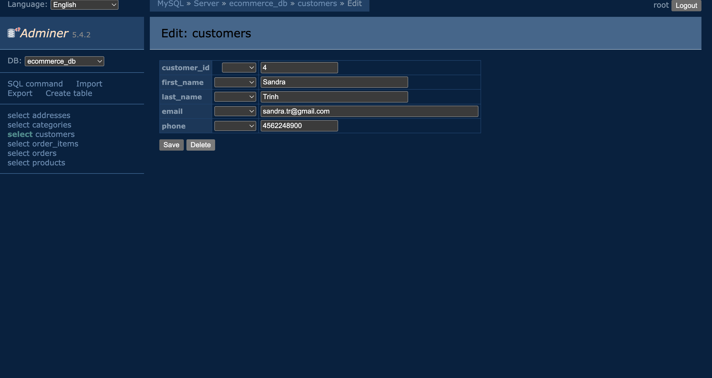

# Cloud-Based MySQL Database Server & Web Interface

A cloud-hosted relational database system built on AWS EC2, featuring a normalized e-commerce schema and a browser-accessible management interface via Adminer.

---

## Tech Stack

| Layer | Technology |
|---|---|
| Cloud Provider | AWS EC2 |
| Operating System | Ubuntu Server 24.04 LTS |
| Database | MySQL 8.0 |
| Web Server | Apache2 + PHP |
| Web Interface | Adminer 5.4.2 |

---

## Cloud Server Setup

An EC2 instance was created on AWS with the following configuration:

| Setting | Value |
|---|---|
| Instance Name | mysql-web-server |
| AMI | Ubuntu Server 24.04 LTS |
| Instance Type | t3.micro (Free Tier) |
| Storage | 8 GiB SSD |
| Key Pair | mysql-key.pem |

### Security Group (Firewall Rules)

| Port | Purpose | Source |
|---|---|---|
| 22 | SSH — remote terminal access | My IP |
| 80 | HTTP — Adminer web interface | Anywhere |
| 3306 | MySQL — database access | My IP |

### Screenshots

> EC2 instance running on AWS dashboard




---

## MySQL Installation

After SSH-ing into the server, MySQL was installed and secured with the following commands:

```bash
# Update package list
sudo apt update

# Install MySQL
sudo apt install mysql-server -y

# Secure the installation
sudo mysql_secure_installation

# Verify MySQL is running
sudo systemctl status mysql
```

---

## Database Schema

The database `ecommerce_db` was designed for a fictional e-commerce store called **Imaginate**. All tables satisfy **Third Normal Form (3NF)** to eliminate data redundancy and transitive dependencies.

- `name` is split into `first_name` / `last_name` for atomicity
- `address` is a separate table — city/state should not depend on customer_id
- `categories` is a separate table — category_name should not depend on product_id
- `order_items` is separated from `orders` — quantity/price depend on both order AND product

### Entity Relationship Overview

```
customers ──< addresses
customers ──< orders ──< order_items >── products >── categories
```

### Table Descriptions

| Table | Description |
|---|---|
| `customers` | Customer personal info (name, email, phone) |
| `addresses` | Customer addresses, separated to avoid transitive dependencies |
| `categories` | Product categories, separated to avoid repeating names in products |
| `products` | Product details with a foreign key to categories |
| `orders` | Order header linked to a customer |
| `order_items` | Individual line items per order, linked to products |

> See [`sql/create_tables.sql`](sql/create_tables.sql) for the full SQL script.

### Screenshot

>MySQL in Terminal showing all 6 tables in ecommerce_db

> > Adminer showing all 6 tables in ecommerce_db


---

## Web Interface — Adminer

Adminer was installed as a single PHP file served by Apache. It provides a full database management UI accessible through any browser.

### Installation

```bash
# Install Apache and PHP
sudo apt install apache2 php php-mysql -y

# Download Adminer to the web root
cd /var/www/html
sudo wget https://www.adminer.org/latest.php -O adminer.php
```

### Accessing the Interface

Open a browser and navigate to:

```
 http://15.156.86.195/adminer.php


```

Log in with:
- **System:** MySQL
- **Server:** localhost
- **Username:** root
- **Password:** Password123!
- **Database:** ecommerce_db

### How Adminer Connects to MySQL

Adminer is a PHP script served by Apache on the same EC2 instance as MySQL. When a user logs in through the browser, Adminer uses PHP's `mysqli` extension to connect to MySQL at `localhost`. This keeps the database connection internal to the server and avoids exposing MySQL directly to the internet.

### Screenshot

> Adminer login page



---

## Testing — Basic Database Operations

All four core database operations were tested through the Adminer interface.

### 1. View Records (SELECT)

Clicked on the `customers` table to view all existing records.



### 2. Insert a Record (INSERT)

Used Adminer's **New item** button to add a new customer record.



### 3. Update a Record (UPDATE)

Used the edit (pencil) icon to modify an existing customer's details.



### 4. Delete a Record (DELETE)

Used the delete (x) icon to remove a record and confirmed the deletion.



---

## Challenges & Lessons Learned

### Challenges

**Adminer login denied** — When attempting to log in to Adminer for the first time, access was denied because a password had not been set for the MySQL root user. This was resolved by setting the root password directly in MySQL:

```sql
ALTER USER 'root'@'localhost' IDENTIFIED WITH mysql_native_password BY 'Password123!';
FLUSH PRIVILEGES;
```

### Lessons Learned

- **SSH key authentication** — the `.pem` key file acts as a private key that must match the public key on the server before access is granted, which is more secure than password-based login.
- **Security groups as firewalls** — restricting port 3306 to only your IP prevents unauthorized access to the database from the internet.
- **3NF in practice** — separating addresses and categories into their own tables eliminates redundancy and makes the database easier to maintain and scale.

---


## Security Notes

- MySQL root access is restricted to `localhost` only
- Port 3306 is not open to the public internet
- SSH access is restricted to a specific IP address
- No credentials or access keys are stored in this repository

---

*Built as part of a cloud computing and database systems course project.*
